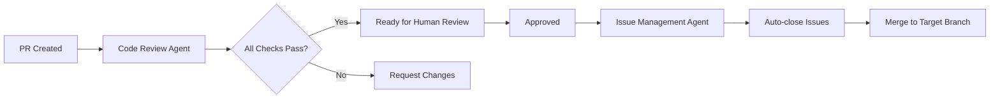
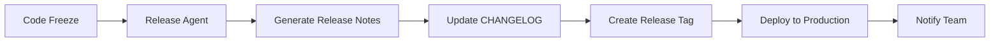

# Development Agents

> **⚠️ DISCLAIMER: This is a fake project for demonstration/testing purposes only.**
>
> **No feedback will be collected or worked on. Use at your own risk.**

## Overview

This document describes the automated agents and assistants configured for this repository to support development workflows, code quality, and team collaboration.

## GitHub Copilot

**Status**: Configured ✅

GitHub Copilot is configured with workspace-specific instructions to help with:
- Code generation following project standards
- Consistent naming conventions
- Proper TypeScript usage
- React best practices
- Git workflow guidance

**Configuration**: [.github/copilot-instructions.md](.github/copilot-instructions.md)

## Available Agents

### 1. Code Review Agent

**Purpose**: Automated code review assistance

**Triggers**:
- New pull request created
- Commits pushed to PR

**Checks**:
- TypeScript compilation
- Linting (ESLint)
- Code formatting (Prettier)
- Test coverage
- Security vulnerabilities

**Configuration**: (To be implemented)

### 2. Issue Management Agent

**Purpose**: Automate issue lifecycle management

**Functions**:
- Auto-label issues based on type (bug, feature, etc.)
- Validate issue hierarchy (Theme → Story → Task)
- Link PRs to related issues
- Auto-close issues when PRs merge
- Remind about stale issues

**Configuration**: (To be implemented)

### 3. Release Agent

**Purpose**: Automate release preparation and deployment

**Functions**:
- Generate release notes from PRs
- Update CHANGELOG.md
- Create release tags
- Notify team of deployments
- Track release metrics

**Configuration**: (To be implemented)

### 4. Documentation Agent

**Purpose**: Keep documentation synchronized

**Functions**:
- Detect outdated documentation
- Suggest documentation updates
- Validate links in markdown files
- Check for missing documentation

**Configuration**: (To be implemented)

### 5. Dependency Management Agent

**Purpose**: Keep dependencies up-to-date and secure

**Functions**:
- Monitor for dependency updates
- Create PRs for security patches
- Flag breaking changes
- Update package.json and lock files

**Configuration**: (To be implemented)

## Agent Workflows

### Pull Request Workflow

### Release Workflow

## Agent Best Practices

### For Developers

1. **Trust but Verify**: Agents are helpers, not replacements for human judgment
2. **Review Agent Suggestions**: Always review automated PRs before merging
3. **Provide Feedback**: Report issues with agent behavior
4. **Follow Standards**: Agents work best when code follows established patterns

### For Maintainers

1. **Monitor Agent Performance**: Track success/failure rates
2. **Update Configurations**: Keep agent rules current with project needs
3. **Balance Automation**: Don't over-automate critical decisions
4. **Document Changes**: Update this file when adding/modifying agents

## Configuring New Agents

To add a new agent to the repository:

1. **Define Purpose**: Clearly state what the agent will do
2. **Create Configuration**: Add config in `.github/agents/`
3. **Set Up Triggers**: Define when the agent runs
4. **Test Thoroughly**: Validate in a test environment first
5. **Document**: Update this file with agent details
6. **Monitor**: Track agent performance after deployment

## Agent Configuration Files

Agent configurations are stored in:
- `.github/agents/` - Agent-specific configurations
- `.github/instructions/` - Detailed instructions for AI assistants
- `.github/workflows/` - GitHub Actions workflows (when implemented)

## Security Considerations

### Agent Permissions

- Agents have limited repository access
- Cannot approve their own PRs
- Cannot override branch protection
- Limited to specific file paths when appropriate

### Secrets Management

- Use GitHub Secrets for sensitive data
- Never commit API keys or tokens
- Rotate credentials regularly
- Use least-privilege access

## Limitations

Current limitations of automated agents:

1. **Context Understanding**: Agents may not understand full business context
2. **Complex Decisions**: Critical decisions still require human review
3. **Edge Cases**: Unusual scenarios may not be handled correctly
4. **Learning Curve**: Team needs time to adapt to agent behaviors

## Future Enhancements

Planned agent improvements:

- [ ] Implement GitHub Actions for CI/CD
- [ ] Add automated testing workflows
- [ ] Set up dependency scanning
- [ ] Configure automated deployments
- [ ] Add performance monitoring agents
- [ ] Implement changelog automation

## Troubleshooting

### Agent Not Running

1. Check trigger conditions
2. Verify permissions
3. Review workflow logs
4. Check for configuration errors

### Unexpected Behavior

1. Review agent logs
2. Check recent configuration changes
3. Verify input data format
4. Test with simplified scenario

## Related Documentation

- [GitHub Copilot Instructions](.github/copilot-instructions.md)
- [Contributing Guidelines](../CONTRIBUTING.md)
- [Branching Strategy](../docs/processes/BRANCHING_STRATEGY.md)
- [Release Process](../docs/processes/RELEASE_PROCESS.md)

## Support

For issues with agents:
1. Check documentation first
2. Review existing issues
3. Create new issue with `agent` label
4. Provide detailed logs and context
